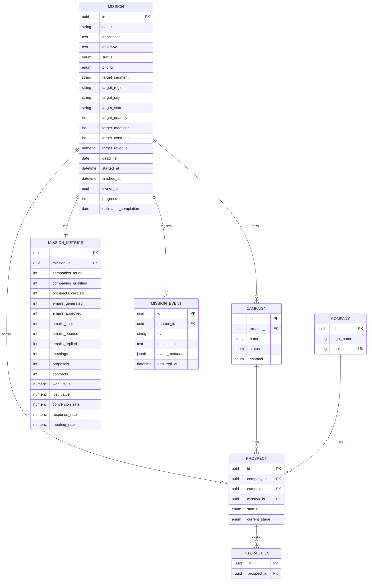

# Domínio Mission

**Mission é o aggregate root principal da plataforma.** Toda prospecção comercial agora existe *dentro* de uma missão: uma `Campaign` não pode existir fora de uma `Mission`, e um `Prospect` não pode existir fora de uma `Mission`. Ver seção "Por que Mission é o aggregate root" no final deste documento.

Todas as tabelas herdam as colunas de auditoria de `AuditMixin` ([`backend/app/models/mixins.py`](../backend/app/models/mixins.py)): `id` (UUID, PK), `created_at`, `updated_at`, `deleted_at` (soft delete), `created_by`, `updated_by`.

## Diagrama ER

## Estrutura das tabelas

### `missions`

| Coluna | Tipo | Constraints |
|---|---|---|
| id | UUID | PK |
| name | VARCHAR(255) | NOT NULL |
| description / objective | TEXT | |
| status | ENUM `mission_status` | NOT NULL, default `draft` (`draft`/`planning`/`running`/`paused`/`finished`/`cancelled`), index |
| priority | ENUM `mission_priority` | NOT NULL, default `normal` (`low`/`normal`/`high`/`critical`), index |
| target_segment | VARCHAR(120) | index |
| target_region | VARCHAR(120) | |
| target_city | VARCHAR(120) | index |
| target_state | VARCHAR(2) | index, `CHECK` 2 letras maiúsculas |
| target_quantity / target_meetings / target_contracts | INTEGER | `CHECK >= 0` |
| target_revenue | NUMERIC(14,2) | `CHECK >= 0` |
| deadline | DATE | index |
| started_at / finished_at | TIMESTAMPTZ | `CHECK finished_at >= started_at` |
| owner_id | UUID | referência ao futuro domínio de usuários (sem FK ainda), index |
| progress | INTEGER | `CHECK` 0-100, calculado por `MissionEngine.calculate_progress()` |
| estimated_completion | DATE | calculado por `MissionEngine.forecast_completion()` |

### `mission_metrics` — snapshot 1:1

| Coluna | Tipo | Constraints |
|---|---|---|
| id | UUID | PK |
| mission_id | UUID | FK → `missions.id` ON DELETE CASCADE, UNIQUE parcial (`WHERE deleted_at IS NULL`) |
| companies_found / companies_qualified / prospects_created | INTEGER | default 0 |
| emails_generated / emails_approved / emails_sent / emails_opened / emails_replied | INTEGER | default 0 — **acumuladores**, não recalculados por `calculate_metrics()` (ver nota abaixo) |
| meetings / proposals / contracts | INTEGER | default 0 |
| won_value / lost_value | NUMERIC(14,2) | default 0 |
| conversion_rate / response_rate / meeting_rate | NUMERIC(5,2) | `CHECK` 0-100 |

> **Por que os 5 contadores de e-mail não são recalculados:** não existe hoje nenhuma tabela de "e-mail enviado/aberto/respondido" no sistema (o `EmailTemplate` é só o texto do template). Esses 5 campos ficam como acumuladores prontos para serem incrementados quando esse pipeline existir (CopyAgent gera → ReviewAgent aprova → um handler de envio incrementa `emails_sent`/`emails_opened`/`emails_replied`). `calculate_metrics()` recalcula tudo que é derivável de `Prospect` hoje (companies/prospects/meetings/proposals/contracts/valores) e as *taxas*, mas nunca sobrescreve esses 5 contadores.

### `mission_events` — timeline

| Coluna | Tipo | Constraints |
|---|---|---|
| id | UUID | PK |
| mission_id | UUID | FK → `missions.id` ON DELETE CASCADE, index |
| event | VARCHAR(120) | index — catálogo aberto (string), não enum (ver decisão abaixo) |
| description | TEXT | |
| event_metadata | JSONB | payload livre (ex.: `{"campaign_id": "..."}`) |
| occurred_at | TIMESTAMPTZ | NOT NULL, index |

`MissionEvent` é a linha persistida; [`MissionTimeline`](../backend/app/services/mission/mission_timeline.py) (em `services/mission/`, não em `models/`) é a API usada para gravar (`record()`) e ler (`list_timeline()`) — é o que `MissionEngine` chama em toda transição de estado.

### Alterações em `campaigns` e `prospects`

| Tabela | Coluna nova | Constraint |
|---|---|---|
| `campaigns` | `mission_id` | FK → `missions.id` ON DELETE CASCADE, **NOT NULL**, index |
| `prospects` | `mission_id` | FK → `missions.id` ON DELETE CASCADE, **NOT NULL**, index |

Em `prospects`, `mission_id` é redundante com `campaign.mission_id` por design — ver "Invariante entre Prospect e Campaign" abaixo.

## `MissionEngine` — métodos

| Método | O que faz |
|---|---|
| `create(...)` | Cria a missão (`status=DRAFT`, `progress=0`), sua `MissionMetrics` zerada, e grava o evento `mission_created` |
| `start(mission)` | `DRAFT`/`PLANNING` → `RUNNING`, carimba `started_at` |
| `pause(mission, reason=None)` | `RUNNING` → `PAUSED` |
| `resume(mission)` | `PAUSED` → `RUNNING` |
| `finish(mission)` | `RUNNING`/`PAUSED` → `FINISHED`, `progress=100`, carimba `finished_at` |
| `cancel(mission, reason=None)` | Qualquer estado não-terminal → `CANCELLED`, carimba `finished_at` |
| `calculate_metrics(mission)` | Recalcula tudo derivável de `Prospect` (ver nota dos e-mails acima) e persiste |
| `calculate_progress(mission)` | Média das metas que estiverem definidas (quantidade/reuniões/contratos/receita), cada uma limitada a 100% |
| `forecast_completion(mission)` | Projeta uma data de conclusão a partir do ritmo atual (prospects criados/dia desde `started_at`) — lê o snapshot de `MissionMetrics`, não recalcula por conta própria |
| `summary(mission)` | Monta um `MissionSummary`: progresso, dias restantes, contagens, receita estimada (ganho realizado + pipeline aberto ponderado por probabilidade), saúde do pipeline e próxima ação recomendada |

Toda transição inválida (ex.: `pause()` numa missão `DRAFT`) levanta `InvalidMissionTransitionError` (ver [`services/mission/exceptions.py`](../backend/app/services/mission/exceptions.py)).

## Por que Mission é o aggregate root

- **Campaign e Prospect não podem mais existir fora de uma Mission.** `campaigns.mission_id` e `prospects.mission_id` são `NOT NULL` — não há como criar nenhum dos dois sem uma missão.
- **Invariante entre Prospect e Campaign:** `Prospect.mission_id` deve ser sempre igual a `Prospect.campaign.mission_id`. Como isso atravessa duas tabelas, não dá para expressar como `CHECK` constraint no Postgres — em vez de confiar na validação, [`ProspectEngine.create_prospect()`](../backend/app/services/prospecting/prospect_engine.py) **deriva** `mission_id` a partir do `campaign_id` (busca a campanha e usa `campaign.mission_id`), em vez de aceitá-lo como parâmetro. Isso torna a inconsistência estruturalmente impossível em vez de apenas validada.
- **MissionMetrics e MissionTimeline dão à missão sua própria "verdade" agregada** — progresso, métricas e histórico não pertencem a nenhuma campanha ou prospect individual, só à missão como um todo.
- **`AIContext` agora carrega `mission`/`mission_metrics`/`mission_history`**: todo agente de IA que atua sobre um prospect/campanha sabe automaticamente qual é o objetivo maior (a missão) por trás daquela ação — sem isso, um agente só veria a árvore, nunca a floresta.

### Nota: colisão de nome resolvida em `AIContext`

O `AIContext` (módulo `ai/`, etapa anterior) já tinha um campo `mission: str | None` — na época, antes deste domínio existir, ele significava "a instrução da execução atual" (ex.: "pesquisar esta empresa"). Para dar lugar ao `Mission` de verdade, esse campo foi renomeado para `instruction` (o que ele sempre significou), e `mission`/`mission_metrics`/`mission_history` passaram a apontar para o domínio real. Os testes de `tests/ai/` foram atualizados de acordo.
