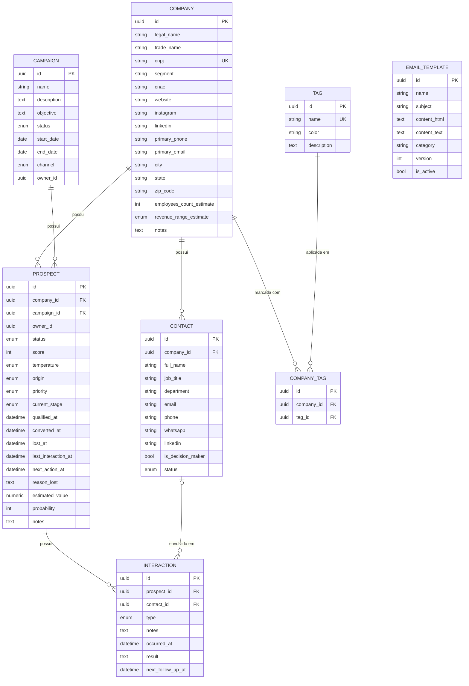

# Domínio Prospecting

Modelo de dados do domínio **Prospecting**: prospecção comercial (empresas, contatos, campanhas, prospects/oportunidades, interações, templates de e-mail e tags).

Todas as tabelas herdam as colunas de auditoria de `AuditMixin` ([`backend/app/models/mixins.py`](../backend/app/models/mixins.py)): `id` (UUID, PK), `created_at`, `updated_at`, `deleted_at` (soft delete), `created_by`, `updated_by`.

> **Revisão 2:** separa "Empresa" (`Company`, registro único e imutável) de "Processo Comercial" (`Prospect`, uma oportunidade com ciclo de vida próprio). `CampaignCompany` foi removida — o vínculo Company × Campaign agora é o próprio `Prospect`. `Interaction` deixou de pertencer à `Company`/`Campaign` e passou a pertencer ao `Prospect`. Ver [`621b99b1a9ed_introduce_prospect_aggregate.py`](../backend/alembic/versions/621b99b1a9ed_introduce_prospect_aggregate.py).
>
> **Revisão 3 (atual):** `Campaign` e `Prospect` agora pertencem obrigatoriamente a uma `Mission` (`mission_id` NOT NULL em ambas) — ver [`domain-mission.md`](domain-mission.md), que documenta por que `Mission` é o aggregate root principal da plataforma a partir de agora.

## Diagrama ER

`EmailTemplate` continua standalone. `CampaignCompany` **não existe mais** — `Prospect` é a associação Company × Campaign, mas com ciclo de vida próprio em vez de ser uma tabela de junção crua.

## Estrutura das tabelas

### `companies` — registro puro da empresa

Perdeu `status` e `lead_source` nesta revisão: uma empresa não tem "status comercial", quem tem é o `Prospect`.

| Coluna | Tipo | Constraints |
|---|---|---|
| id | UUID | PK |
| legal_name | VARCHAR(255) | NOT NULL |
| trade_name | VARCHAR(255) | |
| cnpj | VARCHAR(14) | NOT NULL, `CHECK` 14 dígitos, UNIQUE parcial (`WHERE deleted_at IS NULL`) |
| segment | VARCHAR(120) | index |
| cnae | VARCHAR(10) | |
| website / instagram / linkedin | VARCHAR(255) | |
| primary_phone | VARCHAR(20) | |
| primary_email | VARCHAR(255) | index |
| city | VARCHAR(120) | index |
| state | VARCHAR(2) | index, `CHECK` 2 letras maiúsculas |
| zip_code | VARCHAR(9) | |
| employees_count_estimate | INTEGER | |
| revenue_range_estimate | ENUM `revenue_range` | |
| notes | TEXT | |

### `contacts`

Sem alterações nesta revisão.

| Coluna | Tipo | Constraints |
|---|---|---|
| id | UUID | PK |
| company_id | UUID | FK → `companies.id` ON DELETE CASCADE, index |
| full_name | VARCHAR(255) | NOT NULL |
| job_title / department | VARCHAR(120) | |
| email | VARCHAR(255) | index |
| phone / whatsapp | VARCHAR(20) | |
| linkedin | VARCHAR(255) | |
| is_decision_maker | BOOLEAN | NOT NULL, default false |
| status | ENUM `contact_status` | NOT NULL, default `active`, index |

### `campaigns`

Sem alterações nesta revisão (só perdeu o relacionamento direto com `Interaction`).

| Coluna | Tipo | Constraints |
|---|---|---|
| id | UUID | PK |
| name | VARCHAR(255) | NOT NULL |
| description / objective | TEXT | |
| status | ENUM `campaign_status` | NOT NULL, default `draft`, index |
| start_date / end_date | DATE | `CHECK end_date >= start_date` |
| channel | ENUM `campaign_channel` | NOT NULL, default `email`, index |
| owner_id | UUID | referência ao futuro domínio de usuários (sem FK ainda) |

### `prospects` — NOVA: a oportunidade comercial (aggregate root do processo de vendas)

| Coluna | Tipo | Constraints |
|---|---|---|
| id | UUID | PK |
| company_id | UUID | FK → `companies.id` ON DELETE CASCADE, index |
| campaign_id | UUID | FK → `campaigns.id` ON DELETE CASCADE, index |
| owner_id | UUID | referência ao futuro domínio de usuários (sem FK ainda), index |
| status | ENUM `prospect_status` | NOT NULL, default `open` (`open`/`won`/`lost`/`disqualified`), index |
| score | INTEGER | `CHECK` 0-100, calculado por `ProspectEngine.calculate_score()` |
| temperature | ENUM `prospect_temperature` | NOT NULL, default `cold` (`cold`/`warm`/`hot`), index |
| origin | ENUM `prospect_origin` | como a oportunidade surgiu (website, referral, cold_outreach, ...) |
| priority | ENUM `prospect_priority` | NOT NULL, default `normal` (`low`/`normal`/`high`/`urgent`), index |
| current_stage | ENUM `prospect_stage` | NOT NULL, default `new`, index — funil completo (ver abaixo) |
| qualified_at / converted_at / lost_at | TIMESTAMPTZ | carimbados pelo `ProspectEngine` |
| last_interaction_at | TIMESTAMPTZ | index, atualizado por `register_interaction()` |
| next_action_at | TIMESTAMPTZ | index, definido por `schedule_followup()` |
| reason_lost | TEXT | motivo ao desqualificar/perder |
| estimated_value | NUMERIC(14,2) | `CHECK >= 0` |
| probability | INTEGER | `CHECK` 0-100 |
| notes | TEXT | |

`prospect_stage`: `new`, `researching`, `qualified`, `contact_ready`, `email_pending_approval`, `email_sent`, `follow_up`, `responded`, `meeting`, `proposal`, `negotiation`, `won`, `lost`.

Sem constraint de unicidade em `(company_id, campaign_id)`: uma empresa pode ter múltiplos prospects na mesma campanha ao longo do tempo (ex.: uma oportunidade reaberta após `lost`).

### `interactions`

Antes pertencia a `Company` (+ opcionalmente `Campaign`); agora pertence exclusivamente a `Prospect`.

| Coluna | Tipo | Constraints |
|---|---|---|
| id | UUID | PK |
| prospect_id | UUID | FK → `prospects.id` ON DELETE CASCADE, index (**era `company_id`+`campaign_id`**) |
| contact_id | UUID | FK → `contacts.id` ON DELETE SET NULL, index (nullable) |
| type | ENUM `interaction_type` | NOT NULL, index (email, call, whatsapp, linkedin, meeting, note) |
| notes | TEXT | |
| occurred_at | TIMESTAMPTZ | NOT NULL, index |
| result | TEXT | |
| next_follow_up_at | TIMESTAMPTZ | index (nullable) |

### `email_templates` e `tags` / `company_tags`

Sem alterações nesta revisão — ver histórico da revisão 1 no código dos models.

## Prospect Engine

Módulo de domínio em [`backend/app/services/prospecting/prospect_engine.py`](../backend/app/services/prospecting/prospect_engine.py), classe `ProspectEngine`. Recebe `ProspectRepository` e `InteractionRepository` no construtor. Métodos:

| Método | O que faz |
|---|---|
| `create_prospect(...)` | Abre uma oportunidade nova: `status=OPEN`, `temperature=COLD`, `current_stage=NEW` |
| `qualify(prospect)` | `current_stage → QUALIFIED`, carimba `qualified_at` (idempotente) |
| `disqualify(prospect, reason)` | `status → DISQUALIFIED` (não passou no fit inicial; distinto de `lost`) |
| `change_stage(prospect, stage)` | Move para qualquer estágio do funil, exceto `WON`/`LOST` |
| `calculate_score(prospect)` | Heurística determinística 0-100 (estágio + temperatura + prioridade + recência da última interação) e persiste |
| `mark_as_won(prospect)` | `status → WON`, `current_stage → WON`, carimba `converted_at` |
| `mark_as_lost(prospect, reason)` | `status → LOST`, `current_stage → LOST`, carimba `lost_at` e `reason_lost` |
| `schedule_followup(prospect, when)` | Define `next_action_at` |
| `register_interaction(prospect, ...)` | Cria a `Interaction` e atualiza `last_interaction_at` (e `next_action_at` se houver follow-up) |
| `list_pipeline(owner_id=None)` | Prospects com `status=OPEN`, ordenados por prioridade |
| `list_by_stage(stage)` | Filtra por `current_stage` |
| `list_by_campaign(campaign_id)` | Filtra por campanha |
| `list_by_owner(owner_id)` | Filtra por responsável |
| `search(query, ...)` | Busca livre (nome da empresa / notas) + filtros combináveis |

Todas as transições (`qualify`, `disqualify`, `change_stage`, `mark_as_won`, `mark_as_lost`, `schedule_followup`) validam que o prospect ainda está `OPEN` (`ProspectClosedError` caso contrário — ver [`exceptions.py`](../backend/app/services/prospecting/exceptions.py)).

## Decisões de modelagem

- **Company nunca representa uma oportunidade.** É registro único e estável (razão social, CNPJ, firmografia). Todo o estado de "onde estamos com essa empresa" vive no `Prospect`.
- **`status` (grosseiro) vs. `current_stage` (granular) no `Prospect`**: `status` é a máquina de estados de alto nível (`OPEN → WON | LOST | DISQUALIFIED`, terminal), usada para filtrar rapidamente o pipeline ativo. `current_stage` é a posição no funil (13 estágios), só realmente significativa enquanto `status == OPEN`. Separar os dois evita sobrecarregar um único enum com semânticas diferentes (estado do negócio vs. etapa do processo).
- **`WON`/`LOST` só podem ser atingidos via `mark_as_won()`/`mark_as_lost()`**, nunca via `change_stage()` genérico — garante que `status` e `current_stage` nunca fiquem inconsistentes entre si (ex.: `current_stage=WON` com `status=OPEN`).
- **`CampaignCompany` foi removida, não "esvaziada"**: como o `Prospect` já carrega `company_id` + `campaign_id` e tem ciclo de vida próprio, manter as duas tabelas seria duplicar a mesma associação com semânticas conflitantes.
- **Sem UNIQUE em `(company_id, campaign_id)` em `prospects`**: diferente da antiga `CampaignCompany` (que era um simples "participa ou não"), um `Prospect` é uma instância de oportunidade — reabrir uma nova tentativa comercial para a mesma empresa na mesma campanha é um caso de uso legítimo.
- **`calculate_score()` é uma heurística explicável, não IA**: soma ponderada determinística (funil 40pts + temperatura 30pts + prioridade 15pts + recência 15pts), fora de escopo qualquer modelo preditivo nesta etapa.
- **UUID em todas as PKs**, gerado client-side (`uuid.uuid4()`), sem depender de `pgcrypto`.
- **Soft delete obrigatório** via `deleted_at`; toda unicidade é índice único parcial (`WHERE deleted_at IS NULL`).
- **`created_by`/`updated_by`/`owner_id` sem FK** — domínio de usuários ainda não implementado.
